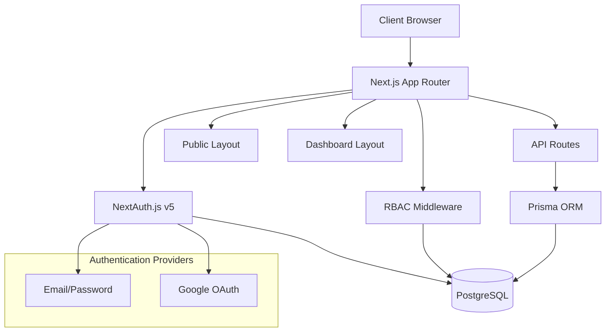

# Design Document

## Overview

The micro SaaS boilerplate is designed as a modern, scalable web application using Next.js 14+ App Router with TypeScript. The architecture emphasizes separation of concerns, type safety, and dynamic role-based access control. The system supports multiple authentication providers and provides role-specific user experiences through a flexible permission system.

## Architecture

### High-Level Architecture



### Technology Stack

- **Frontend**: Next.js 14+ (App Router), React 18+, TypeScript
- **Styling**: TailwindCSS with custom component library
- **Authentication**: NextAuth.js v5+ with JWT strategy
- **Database**: PostgreSQL with Prisma ORM
- **Deployment**: Docker with multi-stage builds
- **Testing**: Vitest for unit tests, Playwright for E2E

### Directory Structure

```
├── app/                          # Next.js App Router
│   ├── (auth)/                   # Auth route group
│   │   ├── login/
│   │   └── signup/
│   ├── (dashboard)/              # Dashboard route group
│   │   ├── admin/
│   │   │   └── dashboard/
│   │   └── customer/
│   │       └── dashboard/
│   ├── (public)/                 # Public route group
│   │   ├── about/
│   │   ├── contact/
│   │   └── page.tsx              # Landing page
│   ├── api/                      # API routes
│   │   ├── auth/
│   │   ├── users/
│   │   └── roles/
│   ├── globals.css
│   ├── layout.tsx
│   └── middleware.ts
├── components/                   # React components
│   ├── ui/                      # Reusable UI components
│   ├── layouts/                 # Layout components
│   ├── auth/                    # Auth-specific components
│   └── dashboard/               # Dashboard components
├── lib/                         # Utility libraries
│   ├── auth/                    # NextAuth configuration
│   ├── db/                      # Database utilities
│   ├── rbac/                    # RBAC utilities and hooks
│   └── utils/                   # General utilities
├── prisma/                      # Database schema and migrations
│   ├── schema.prisma
│   ├── migrations/
│   └── seed.ts
├── tests/                       # Test files
├── docker/                      # Docker configuration
├── .env.example
└── package.json
```

## Components and Interfaces

### Database Schema Design

```prisma
model User {
  id            String    @id @default(cuid())
  email         String    @unique
  name          String?
  password      String?   // For credential auth
  image         String?   // For OAuth providers
  emailVerified DateTime?
  createdAt     DateTime  @default(now())
  updatedAt     DateTime  @updatedAt
  
  // RBAC relationships
  userRoles     UserRole[]
  
  // NextAuth relationships
  accounts      Account[]
  sessions      Session[]
}

model Role {
  id          String @id @default(cuid())
  name        String @unique
  description String?
  createdAt   DateTime @default(now())
  updatedAt   DateTime @updatedAt
  
  // RBAC relationships
  userRoles       UserRole[]
  rolePermissions RolePermission[]
}

model Permission {
  id          String @id @default(cuid())
  name        String @unique  // e.g., "view:users", "manage:roles"
  resource    String          // e.g., "users", "roles", "analytics"
  action      String          // e.g., "view", "create", "update", "delete"
  description String?
  createdAt   DateTime @default(now())
  
  rolePermissions RolePermission[]
}

model UserRole {
  id     String @id @default(cuid())
  userId String
  roleId String
  
  user User @relation(fields: [userId], references: [id], onDelete: Cascade)
  role Role @relation(fields: [roleId], references: [id], onDelete: Cascade)
  
  @@unique([userId, roleId])
}

model RolePermission {
  id           String @id @default(cuid())
  roleId       String
  permissionId String
  
  role       Role       @relation(fields: [roleId], references: [id], onDelete: Cascade)
  permission Permission @relation(fields: [permissionId], references: [id], onDelete: Cascade)
  
  @@unique([roleId, permissionId])
}
```

### RBAC System Design

#### Permission Structure
Permissions follow a `action:resource` pattern:
- `view:users` - Can view user list
- `manage:users` - Can create/edit/delete users
- `view:analytics` - Can view analytics dashboard
- `manage:roles` - Can manage roles and permissions

#### Core RBAC Interfaces

```typescript
// lib/rbac/types.ts
export interface Permission {
  id: string;
  name: string;
  resource: string;
  action: string;
  description?: string;
}

export interface Role {
  id: string;
  name: string;
  description?: string;
  permissions: Permission[];
}

export interface UserWithRoles {
  id: string;
  email: string;
  name?: string;
  roles: Role[];
}

export type PermissionCheck = {
  resource: string;
  action: string;
};
```

#### RBAC Utilities

```typescript
// lib/rbac/permissions.ts
export class PermissionChecker {
  static hasPermission(
    userRoles: Role[],
    requiredPermission: string
  ): boolean {
    return userRoles.some(role =>
      role.permissions.some(permission =>
        permission.name === requiredPermission
      )
    );
  }
  
  static hasAnyPermission(
    userRoles: Role[],
    requiredPermissions: string[]
  ): boolean {
    return requiredPermissions.some(permission =>
      this.hasPermission(userRoles, permission)
    );
  }
  
  static hasAllPermissions(
    userRoles: Role[],
    requiredPermissions: string[]
  ): boolean {
    return requiredPermissions.every(permission =>
      this.hasPermission(userRoles, permission)
    );
  }
}
```

### Authentication System Design

#### NextAuth Configuration

```typescript
// lib/auth/config.ts
export const authConfig: NextAuthConfig = {
  providers: [
    Credentials({
      credentials: {
        email: { label: "Email", type: "email" },
        password: { label: "Password", type: "password" }
      },
      async authorize(credentials) {
        // Credential validation logic
        // Returns user with roles attached
      }
    }),
    Google({
      clientId: process.env.GOOGLE_CLIENT_ID,
      clientSecret: process.env.GOOGLE_CLIENT_SECRET,
    })
  ],
  callbacks: {
    async jwt({ token, user }) {
      if (user) {
        // Attach user roles to JWT token
        const userWithRoles = await getUserWithRoles(user.id);
        token.roles = userWithRoles.roles;
      }
      return token;
    },
    async session({ session, token }) {
      // Attach roles to session
      session.user.roles = token.roles;
      return session;
    }
  }
};
```

### Middleware Design

```typescript
// app/middleware.ts
export async function middleware(request: NextRequest) {
  const session = await getServerSession(authConfig);
  const pathname = request.nextUrl.pathname;
  
  // Public routes - no auth required
  if (isPublicRoute(pathname)) {
    return NextResponse.next();
  }
  
  // Auth required routes
  if (!session) {
    return NextResponse.redirect(new URL('/login', request.url));
  }
  
  // RBAC check for protected routes
  const requiredPermissions = getRoutePermissions(pathname);
  if (requiredPermissions.length > 0) {
    const hasAccess = PermissionChecker.hasAnyPermission(
      session.user.roles,
      requiredPermissions
    );
    
    if (!hasAccess) {
      return NextResponse.redirect(new URL('/unauthorized', request.url));
    }
  }
  
  return NextResponse.next();
}
```

### Layout System Design

#### Public Layout
- Header with navigation (Home, About, Contact, Login/Signup)
- Footer with links and company information
- Responsive design with mobile menu
- SEO-optimized meta tags

#### Dashboard Layout
- Sidebar navigation based on user permissions
- Header with user avatar, notifications, and logout
- Breadcrumb navigation
- Main content area with consistent spacing
- Mobile-responsive with collapsible sidebar

### Component Library Design

#### Core UI Components
- Button (variants: primary, secondary, outline, ghost)
- Card (with header, content, footer sections)
- Modal (with overlay, close button, and actions)
- Form components (Input, Select, Checkbox, etc.)
- Loading states (Spinner, Skeleton)
- Alert/Toast notifications

#### Theme System Design

The application uses a comprehensive dark mode implementation with:

```typescript
// lib/theme/types.ts
export type Theme = 'light' | 'dark' | 'system';

export interface ThemeConfig {
  theme: Theme;
  systemTheme: 'light' | 'dark';
  resolvedTheme: 'light' | 'dark';
}
```

#### Theme Provider Implementation

```typescript
// components/theme/ThemeProvider.tsx
export function ThemeProvider({ children }: { children: React.ReactNode }) {
  const [theme, setTheme] = useState<Theme>('system');
  const [systemTheme, setSystemTheme] = useState<'light' | 'dark'>('light');
  
  // Theme persistence and system detection logic
  // Automatic theme switching based on system preferences
  // Local storage persistence for user preferences
}
```

#### TailwindCSS Dark Mode Configuration

```javascript
// tailwind.config.js
module.exports = {
  darkMode: 'class',
  theme: {
    extend: {
      colors: {
        background: 'hsl(var(--background))',
        foreground: 'hsl(var(--foreground))',
        // CSS custom properties for theme-aware colors
      }
    }
  }
}
```

#### RBAC-Aware Components

```typescript
// components/rbac/PermissionGate.tsx
interface PermissionGateProps {
  permission: string;
  fallback?: React.ReactNode;
  children: React.ReactNode;
}

export function PermissionGate({ 
  permission, 
  fallback = null, 
  children 
}: PermissionGateProps) {
  const hasPermission = useHasPermission(permission);
  return hasPermission ? <>{children}</> : <>{fallback}</>;
}
```

## Data Models

### User Management
- User profiles with role assignments
- Session management through NextAuth
- OAuth account linking
- Email verification workflow

### Role and Permission Management
- Dynamic role creation and assignment
- Permission-based resource access
- Hierarchical permission inheritance (future enhancement)
- Audit logging for permission changes

### Application Data
- Multi-tenant data isolation (future enhancement)
- Soft delete patterns for data retention
- Optimistic locking for concurrent updates

## Error Handling

### Client-Side Error Handling
- React Error Boundaries for component-level errors
- Form validation with Zod schemas
- Toast notifications for user feedback
- Graceful degradation for permission failures

### Server-Side Error Handling
- Structured API error responses
- Database transaction rollbacks
- Authentication error handling
- Rate limiting and abuse prevention

### Error Response Format

```typescript
interface ApiError {
  error: {
    code: string;
    message: string;
    details?: Record<string, any>;
  };
  timestamp: string;
  path: string;
}
```

## Testing Strategy

### Unit Testing
- RBAC permission checking logic
- Authentication utility functions
- Database model validation
- Component rendering with different permission states

### Integration Testing
- Authentication flows (credential and OAuth)
- API route protection
- Database operations with transactions
- Middleware permission checking

### End-to-End Testing
- Complete user registration and login flows
- Role-based dashboard access
- Admin role and permission management
- Cross-browser compatibility

### Testing Tools and Patterns
- Vitest for unit and integration tests
- Playwright for E2E testing
- Mock Service Worker for API mocking
- Test database with Docker for isolation

## Security Considerations

### Authentication Security
- Password hashing with bcrypt
- JWT token rotation and expiration
- CSRF protection with NextAuth
- Secure cookie configuration

### Authorization Security
- Server-side permission validation
- API route protection
- SQL injection prevention with Prisma
- Input validation and sanitization

### Data Protection
- Environment variable security
- Database connection encryption
- HTTPS enforcement in production
- Audit logging for sensitive operations

## Performance Optimization

### Database Optimization
- Efficient queries with Prisma includes
- Database indexing for role/permission lookups
- Connection pooling configuration
- Query result caching strategies

### Frontend Optimization
- Code splitting by route groups
- Component lazy loading
- Image optimization with Next.js
- Static generation for public pages

### Caching Strategy
- Session data caching
- Permission lookup caching
- Static asset caching with CDN
- Database query result caching

## Deployment Architecture

### Docker Configuration
- Multi-stage builds for optimization
- Development and production environments
- Database migration handling
- Health check endpoints

### Environment Configuration
- Separate configs for dev/staging/production
- Secret management best practices
- Database connection string security
- OAuth provider configuration

### Monitoring and Logging
- Application performance monitoring
- Error tracking and alerting
- User activity logging
- Database performance metrics